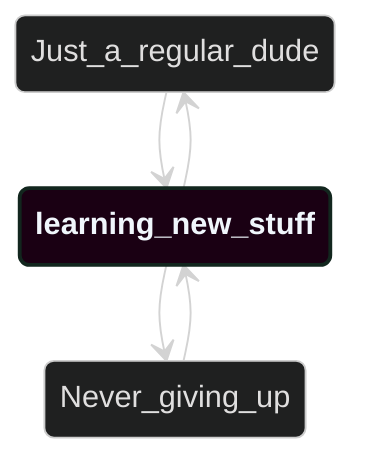

<h1 align="left">
Thales Fecarisi
</h1>
<a>
  Who am I
</a>

```mermaid
%%{init: {'theme' : 'dark'}}%%
stateDiagram-v2
accTitle: Who am I ?
   accDescr: Just passing by

   classDef NeverStop fill:#1a0013,color:#F0F6FC,font-weight:bold,stroke-width:2px,stroke:#12261e

    Just_a_regular_dude --> learning_new_stuff
    learning_new_stuff --> Just_a_regular_dude
    learning_new_stuff --> Never_giving_up
    Never_giving_up --> learning_new_stuff


   class learning_new_stuff NeverStop
```

🔨 Quite my favorite 

🚧 Work in progress

🤔 Backlog 

